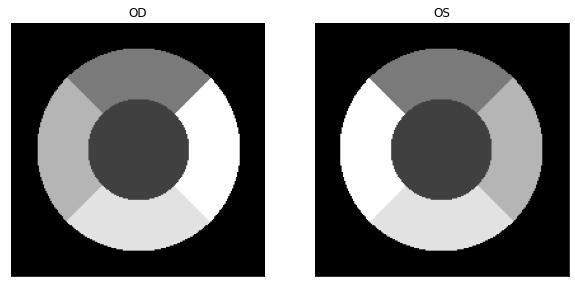
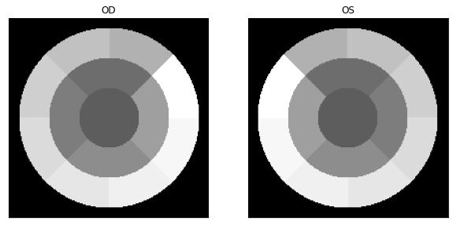

# eyeseg
eyeseg is a command line application to segment OCT layers and quantify drusen. It can read and process Spectralis XML and VOL exports and models used for OCT layer segmentation might give unexpected results on data from other devices than Spectralis.

## Installation
You can install eyeseg using `pip`.

```shell
pip install eyeseg
```

## Requirements
Your data has to be in the Spectralis XML or VOL export format. In case of the XML export, make sure that your data is exported with a black background and every folder contains a single volume (single XML file).

## Usage
This package ships a single application called `eyeseg`. You can run this application without any arguments to see a help message.

### Check your data for common problems

To check mounted data for common problems such as inverted contrast and multiple exports per directory run

```shell
eyeseg -i /home/data check
```

### Train a new model

To train a new model, you first need to create a data split for your data. Then you can run the train script on your data split.

#### Preprocess your data

#### Train and evaluate

### Segment OCT layers
To segment layers use the `eyeseg layers` command. See examples below:

+ Predict layers for volumes located in the current folder and write layers to ./processed
    ```shell
    eyeseg layers
    ```

+ Predict layers for volumes located in /path/to/data and write layers to /path/to/processed.
    ```shell
    eyeseg -i /path/to/data -o /path/to/processed layers
    ```

### Compute Drusen
To compute drusen use the `eyeseg drusen` command. Make sure the output path is the same as you used for the `eyeseg layers` command.

+ Compute drusen for volumes located in the current folder and layers saved in ./processed. Here a default drusen threshold of 2 is used for filtering drusen.
    ```shell
    eyeseg drusen
    ```

### Quantify Drusen
To quantify drusen use the `eyeseg quantify` command. Make sure the output path is the same as you used for the `eyeseg drusen` command. Results are saved in a file `drusen_results.csv` under the output path. See an example below:
+ Quantify drusen for volumes located in the current folder and drusen saved in ./processed. The options in this example command specify the default quantification grid.
    ```shell
    eyeseg quantify -r 0.8 -r 1.8 -s 1 -s 4 -o 0 -o 45
    ```

#### The quantification grid
Drusen quantification is performed on a circular grid centered on the localizer image. The grid is scaled according to the respective volumes scales provided in the meta data and flipped according to the laterality.

Arbitrary grids can be configured:
+ Specify the ring radii in ascending order in [mm] with the `-r` option.
+ Specify the respective number of sectors per ring with the `-s` option.
+ Specify the angular offset from the horizontal line in each ring in degree with the `-o` option.

By default the first sector starts on the nasal side from the horizontal line and subsequent sectors are added counter-clockwise for OD volumes and clockwise for OS volumes. See examples below:

+ Quantification grids for parameters `-r 1 -r 2 -s 1 -s 4 -o 0 -o 45`



+ Quantification grids for parameters `-r 1 -r 2 -r 3 -s 1 -s 4 -s 8 -o 0 -o 45, -o 45`



### Plot enface overviews
To plot enface overviews with an overlay of the computed drusen use the 'eyeseg plot-enface' command. Make sure the output path is the same as you used for the `eyeseg drusen` command.
+ Plot the localizer image with drusen overlay and the B-scan area and positions indicated.
    ```shell
    eyeseg plot-enface --drusen --bscan-area --bscan-position
    ```

### Plot B-scans
To plot bscans with an overlay of the computed drusen and predicted layers use the 'eyeseg plot-bscans' command. Make sure the output path is the same as you used for the `eyeseg drusen` command.
+ Plot bscans for the volumes indicated by the -v option. Without this option B-scans for all available volumes are plotted. If you want to plot predicted layers specify them with the -l option. By default no layers are plotted.
    ```shell
    eyeseg plot-bscans --drusen -l BM -l RPE -v volume_name -v volume_name2
    ```

## Development
To get started clone this repository.

### Install dependencies

This project uses Poetry for dependency management and packaging. You can install with the following command:
```shell
curl -sSL https://install.python-poetry.org | python3 -
```
You might have to add `poetry` to your `PATH`. Then you can run `poetry install` from within this project to install it in editable mode with all dependencies.

You can find the documentation of Poetry [here](https://python-poetry.org/docs/). I mainly use it to add dependencies with `poetry add` or to start the project specific virtual environment `poetry shell`.

### Commit your changes

Before committing for the first time please install the pre-commit hooks with
```shell
pre-commit install
```
`pre-commit` is a development dependency of this project, so it is already installed in the projects virtual environment. You can find the `pre-commit` documentation [here](https://pre-commit.com/)

One of the installed pre-commit hooks checks whether your commit message follows the [conventional commits](https://www.conventionalcommits.org/) standard. Standardized commit messages allow for the automatic creation of a changelog and automatic version bumping.
To create such a standardized commit message use `commitizen` to make your commit. It creates your commit message from a number of questions.
Commitizen is already installed in the project virtual environment and can be used with the following command:
```shell
cz commit
```

### Create a new version and publish to PyPI
Version bumping and publishing to PyPI is done automatically via Github Actions, based on your commit message, when pushing changes to the master.


### Build a docker image
To build a docker image from the current code and export it to an archive run

```shell
bash ./scripts/make_docker_image.sh
```

The image can be loaded from the archive with

```shell
docker load -i docker_eyeseg-VERSION-gpu.tar.gz
```

To use the image you need to start a container from the image, having the data mounted you want to process.

```shell
docker run -u $(id -u):$(id -g) --gpus=all -v YOUR_DATA_PATH:/home/data -it medvisbonn/eyeseg:VERSION-gpu
```

### Remarks for using the docker image

+ You need `nvidia-docker2` installed for GPU access
+ To make data available in the container you need to mount the respective folder when starting the container
+ If you use the rootless version of docker do not use the `-u` option
